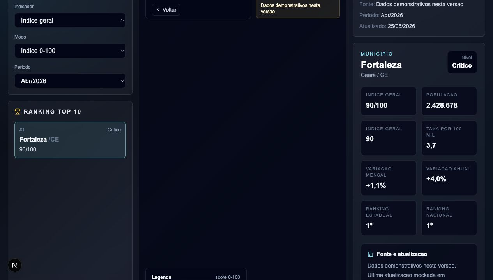

# Mapa da Violencia Brasil

Aplicacao web experimental para visualizar indicadores de violencia no Brasil em um mapa dinamico. A versao atual valida a experiencia de produto com navegacao Brasil -> Estado -> Municipio e inicia a transicao para dados oficiais agregados.

> A camada oficial atual usa uma amostra versionada do SINESP/MJSP para homicidio doloso municipal, medido em vitimas. A carga nacional completa ainda deve ser gerada localmente antes de publicacao ampla.

## Demo

Deploy Vercel: https://mapa-da-violencia-brasil.vercel.app



## Funcionalidades atuais

- Mapa dinamico com MapLibre GL JS.
- Visao Brasil -> Estado -> Municipio.
- Centroides municipais coloridos por score de 0 a 100.
- Filtros por indicador de violencia disponivel na camada ativa.
- Filtros por modo de visualizacao: indice, total, taxa por 100 mil e variacao mensal.
- Ranking de municipios mais criticos conforme o filtro atual.
- Painel de detalhes por municipio.
- Pagina de metodologia em `/metodologia`.
- APIs para mapa, municipio, metadata, health e status de fontes.
- Aviso visivel sobre amostra oficial ou dados demonstrativos conforme a camada ativa.
- Camada OSINT demonstrativa separada dos dados oficiais.

## Stack

- Next.js
- TypeScript
- Tailwind CSS
- MapLibre GL JS
- ESLint
- Dados oficiais agregados em modo offline/local e fallback demonstrativo

## Como rodar localmente

Instale as dependencias:

```bash
npm install
```

Inicie o servidor de desenvolvimento:

```bash
npm run dev
```

Acesse:

```txt
http://localhost:3000
```

## Comandos uteis

```bash
npm run lint
npm run typecheck
npm run test
npm run build
```

Se `npm` nao estiver disponivel no `PATH` desta maquina, use o script local de
validacao com fallback para o runtime Node do Codex:

```bash
bash scripts/validate-local.sh
```

Gerar JSON app-ready a partir do CSV SINESP municipal combinado com populacao:

```bash
python3 -m etl.official_data generate-app-ready --write-samples
```

## Deploy

O projeto esta publicado na Vercel como aplicacao Next.js, sem variaveis de ambiente obrigatorias nesta fase. Veja [docs/DEPLOY.md](docs/DEPLOY.md).

## Estrutura do projeto

```txt
src/app        Rotas Next.js, pagina principal, metodologia e APIs
src/components Componentes visuais do dashboard, mapa, filtros e paineis
src/data       Amostra oficial versionada, dados demonstrativos e placeholders geograficos
src/lib        Utilitarios de calculo, formatacao, ranking, risco e navegacao
src/services   Camada de leitura preparada para substituir mocks por API real
src/types      Tipos compartilhados de crime, mapa e geografia
docs           Documentacao tecnica, arquitetura, metodologia e proximas fases
etl            Fundacao inicial para scripts e testes de ETL
```

## Roadmap resumido

1. Camada real de UFs.
2. Populacao IBGE.
3. Base SINESP/VDE.
4. Normalizacao dos indicadores.
5. Banco Supabase/PostGIS.
6. Poligonos municipais.
7. Vector tiles ou PMTiles.
8. Indice geral real.
9. Atualizacao automatica.

## Licenca

Este projeto esta licenciado sob a GNU Affero General Public License v3.0. Veja [LICENSE](LICENSE).
